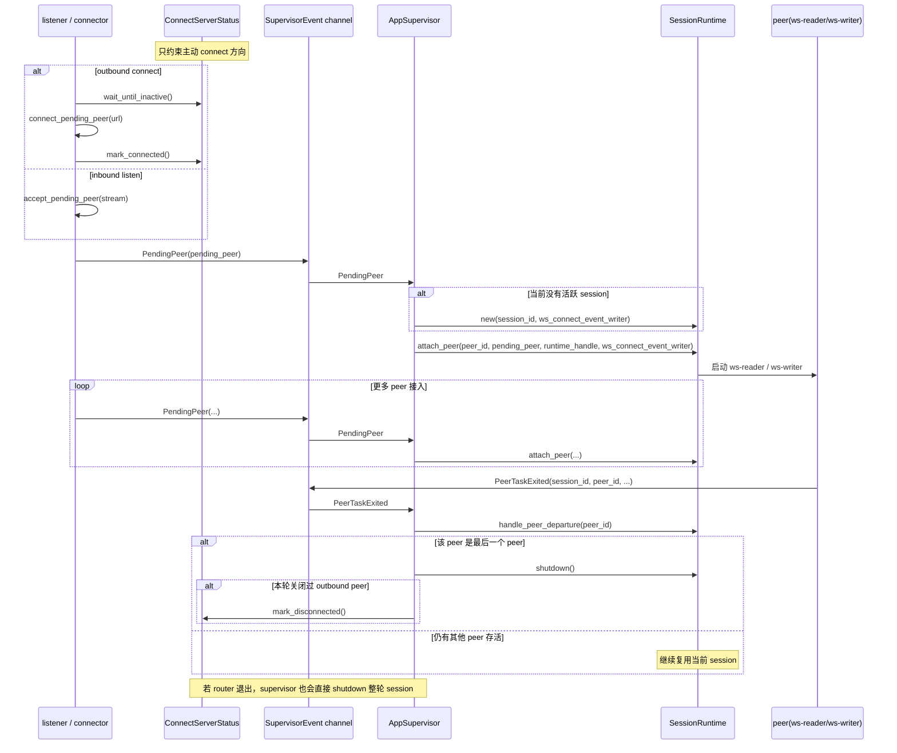

# client-rust

## 项目简介

`client-rust` 是一个运行在小爱音箱里的 WebSocket 音频客户端，用于在音箱本地与远端服务之间转发音频、事件和控制消息。

这个项目是对 [`open-xiaoai/packages/client-rust`](https://github.com/idootop/open-xiaoai/tree/main/packages/client-rust) 的完全重构，目标是在延续原有使用场景的基础上，进一步提升 client 程序的性能、安全性与可维护性。原始项目目前已经归档，不再维护。

本项目完整兼容旧版 client 的全部输入输出接口，保持原有程序对接方式不变，可直接平滑替换旧程序。

> 如果这个项目对你有帮助，欢迎点一个 Star ⭐

### 当前版本的重点改进

- 大幅降低 CPU 占用：将 client 程序的 CPU 占用从旧版本接近 `100%` 的常驻占用，优化到约 `1%` 的日常占用水平。
- 重做 `session` 生命周期：`session` 不再绑定单个 WebSocket 连接，而是绑定一组共享 router、monitor 与网络出口、但按 peer 隔离音频设备的对端集合，资源创建与回收更清晰。
- 支持更稳定的多连接模型：除 `connect-only` 外，还支持 `listen-only` 和 `hybrid` 模式，监听与主动重连常驻运行，不因单个 peer 波动打断整轮服务。
- 优化音频隔离语义：播放和录音都改为按 peer 独立管理，避免多对端之间共享同一条本地音频链路。
- 强化安全边界：listener 和主动外连都支持 Bearer Token，调试输出会对 websocket token 做脱敏处理，避免敏感信息直接落日志。
- 改善异常恢复与可观测性：单个 peer 的 reader / writer 可独立退出并收敛，session 会按生命周期完整清理，同时保留轻量调试日志与限频输出。
- 提升可维护性：网络、协议、monitor、音频、shell、supervisor 等模块边界被重新梳理，后续扩展和排障成本更低。
- 增加 LX06 专用录音能力初始化：启动阶段自动检查 `micocfg_model`，必要时补齐 `/etc/asound.conf` 与 `/etc/asound.conf.dts` 中的 `pcm.lx06_aec_2ch` 配置，并以该能力结果控制 `fast_recording` / `llm_start` / `llm_stop` 是否注册。
- 增加 `xiaoai_exit` 远端命令：用于服务端请求 client 重启小爱原生 AIVS 服务。

当前版本支持 3 种运行模式：

- `connect-only`：主动连接一个远端 `websocket_server_url`
- `listen-only`：监听 `0.0.0.0:4399`，等待远端连入
- `hybrid`：既监听 `4399`，又在后台持续重试主动连接 `websocket_server_url`

和旧版不同，当前的 `session` 不再等同于“单个 ws 连接”，而是等同于“一组共享 router、monitor 和网络出口，但每个 peer 自带独立 player / recorder 的对端集合”：

- 第一个 peer 接入时创建 session
- 本地 `Event` 会广播给当前所有 peer
- 某个 peer 发来的 `Request` 只会回给该 peer 自己
- 每个发起录音命令（`start_recording` / `fast_recording`）的 peer 只会收到自己对应 recorder 产出的录音流
- 最后一个 peer 退出时，session 会完整清理并回到监听 / 外连重试空闲态

## 编译与运行

这个程序依赖小爱音箱上的音频设备、`ubus`、`mphelper` 以及对应日志文件，不能在普通开发机环境中直接运行。推荐流程是：在开发机上交叉编译，再把生成的二进制拷贝到音箱里运行。

### 在开发机上交叉编译

```bash
make build
```

等价命令：

```bash
cross build --release --target armv7-unknown-linux-gnueabihf
```

构建产物：

```bash
./target/armv7-unknown-linux-gnueabihf/release/client
```

### 在音箱上运行

将上面的 `client` 二进制拷贝到小爱音箱后，再在音箱环境中执行。

仅主动连接：

```bash
./client ws://your-websocket-server:4399
```

仅监听：

```bash
./client -l
```

监听 + 主动连接：

```bash
./client -l ws://your-websocket-server:4399
```

开启调试日志时，`debug` 或 `-d` 可以和 `-l` / URL 任意组合：

```bash
./client -d -l ws://your-websocket-server:4399
```

主动连接时附带 Bearer Token：

```bash
./client -t your-websocket-token ws://your-websocket-server:4399
```

命令行规则：

- 语法：`client [debug|-d] [-l] [-t websocket_token] [websocket_server_url]`
- `-l` 开启监听模式，监听地址固定为 `0.0.0.0:4399`
- `-t websocket_token` 仅在主动连接方向使用，会以 Bearer Token 形式附带到握手请求
- `websocket_server_url` 在 connect-only 和 hybrid 模式下使用
- 不允许既不传 `-l`，也不传 `websocket_server_url`

## 外部依赖

项目默认依赖以下小爱音箱环境中的命令或文件：

- `aplay`：播放 PCM 音频
- `arecord`：采集 PCM 音频
- `micocfg_model`：启动阶段识别设备型号，LX06 设备才启用 fast recording 能力
- `mount`：LX06 设备上用于 `mount --bind` 覆盖 ALSA 配置文件
- `/etc/asound.conf`、`/etc/asound.conf.dts`：LX06 设备上会检查并按需补齐 `pcm.lx06_aec_2ch` 配置
- `/etc/init.d/mico_aivs_lab`：`xiaoai_exit` 命令会重启该服务
- `/bin/sh`：执行 `run_shell` 和固定的 `xiaoai_exit` 脚本
- `mphelper mute_stat`：读取播放状态
- `/tmp/mico_aivs_lab/instruction.log`：instruction monitor 监听文件
- `/tmp/open-xiaoai/kws.log`：kws monitor 监听文件

## LX06 fast recording 能力初始化

启动时，client 会在进程级执行一次 LX06 音频能力检查，后续每轮 session 只复用该结果，不会因为 WebSocket 重连而重复执行 mount。

检查流程：

1. 执行 `micocfg_model`。
2. 只有命令成功且输出为 `LX06` 时，才继续准备 LX06 录音能力；非 LX06 设备会跳过该能力，`fast_recording` / `llm_start` / `llm_stop` 不会注册。
3. 分别读取 `/etc/asound.conf` 和 `/etc/asound.conf.dts`。
4. 如果文件中已存在精确的 `pcm.lx06_aec_2ch` 定义，则认为该文件已具备能力，跳过 patch 与 mount。
5. 如果不存在，则把原文件复制到程序所在目录下的同名文件：`asound.conf` 或 `asound.conf.dts`，并插入以下配置。优先插入到 `defaults.pcm.rate_converter "speexrate_medium"` 之前；如果找不到该锚点，则追加到文件末尾。
6. 使用 `mount --bind <程序目录/文件名> /etc/asound.conf` 或 `mount --bind <程序目录/文件名> /etc/asound.conf.dts` 覆盖系统配置。
7. 两个文件都成功处理后，才认为 LX06 fast recording 能力可用。

自动插入的 ALSA 配置如下：

```txt
pcm.lx06_aec_2ch_route {
    type route
    slave {
        pcm "Capture"
        channels 8
    }

    ttable.0.0 1
    ttable.1.6 1
}

pcm.lx06_aec_2ch {
    type plug
    slave {
        pcm "lx06_aec_2ch_route"
        format S32_LE
        rate 48000
        channels 2
    }
}
```

该配置把 `Capture` 的 ch0 与 ch6 路由成新的双通道 PCM；实际 `fast_recording` 阶段通过 `plug` 以 `-c 1` 获取单通道 KWS 音频，`llm_start` 后以 `-c 2` 获取双通道 LLM/AEC 音频。

## 目录结构

```text
src/
├── main.rs
├── config.rs             # CLI 解析、usage 与 RunConfig
├── app/
│   ├── capabilities.rs    # 启动阶段本机能力探测结果
│   ├── commands.rs        # session 级命令注册与本地能力装配
│   ├── fanout.rs          # session 级 monitor 句柄托管
│   ├── mod.rs
│   ├── peer_context.rs    # per-peer 完整上下文：媒体对象、网络 sender、ws 关闭句柄
│   ├── session.rs         # SessionRuntime、peer attach/detach、peer/router 退出事件
│   ├── supervisor.rs      # 进程级编排与 SupervisorEvent 总线
│   ├── ws_ingress.rs      # listener / connector 线程与外连状态闸门
│   └── mod.rs
├── audio/
│   ├── config.rs          # 统一音频参数与 AudioConfig
│   ├── mod.rs
│   ├── player.rs          # 本地 PCM 播放链路
│   └── recorder.rs        # 本地 PCM 录音链路
├── base/
│   ├── debug.rs           # 轻量调试日志与限频输出
│   ├── error.rs           # AppError 统一错误别名
│   ├── mod.rs
│   └── version.rs         # 编译期版本号
├── monitor/
│   ├── file.rs            # 可停止的文件监听基础设施
│   ├── instruction.rs     # instruction monitor
│   ├── kws.rs             # kws monitor
│   ├── mod.rs
│   └── playing.rs         # 播放状态 monitor
├── protocol/
│   ├── data.rs            # Event / Request / Response / Stream
│   ├── mod.rs
│   ├── registry.rs        # 本地命令注册表
│   └── router.rs          # 会话内统一分发线程
├── shell/
│   ├── command.rs         # 本地 shell 命令执行与结果封装
│   ├── device.rs          # 设备 MAC 读取与 listen code 生成
│   ├── lx06_audio.rs      # LX06 ALSA fast recording 能力初始化
│   ├── mod.rs
│   └── speaker.rs         # 从旧项目迁移的设备控制方法备份（当前未接入编译链）
└── transport/
    ├── codec.rs           # 协议对象 <-> websocket frame
    ├── control.rs         # PeerId / PeerSource / SessionControl 等边界类型
    ├── mod.rs
    └── ws_pump.rs         # 单 peer ws reader/writer 与建连/accept
```

## 核心架构

### 1. 长生命周期入口

`AppSupervisor` 在进程生命周期内常驻，负责：

- 启动 listener 线程，持续监听 `0.0.0.0:4399`
- 在有 `websocket_server_url` 时启动 connector 线程，持续后台 retry
- 消费 `supervisor.rs` 里的 `SupervisorEvent`，决定何时创建、复用或销毁 `SessionRuntime`

当前 `app` 目录的职责分层如下：

- `supervisor.rs`：承载进程级状态机、`SupervisorEvent` 总线，以及“何时创建/销毁 session”的决策逻辑
- `session.rs`：承载 `SessionRuntime`、peer attach/detach、peer/router 退出等待逻辑
- `peer_context.rs`：承载 per-peer 的完整上下文，包括 `AudioPlayer` / `AudioRecorder`、网络 sender 和 `WsPeerHandle`
- `fanout.rs`：承载 `MonitorHandles`
- `commands.rs`：承载命令注册，把 per-peer 播放器、录音器、shell 等能力装配到 registry
- `ws_ingress.rs`：承载 listener / connector 线程，以及 `ConnectServerStatus`

### 2. 短生命周期 session

一个 session 内共享以下资源：

- `router-thread`
- `PeerContextRegistry`
- `instruction / playing / kws` 三个 monitor

同时，每个 peer 会独立持有：

- `AudioPlayer`
- `AudioRecorder`
- `control_sender`
- `audio_sender`
- `WsPeerHandle`

第一个 peer 接入时创建 session 级资源；每个 peer attach 时再创建它自己的 player / recorder；最后一个 peer 离开时统一回收。

### 3. 每个 peer 的独立网络收发

每个 peer 都有自己的一套：

- `ws-reader`
- `ws-writer`
- control 队列
- audio 队列
- `WriteSignal`
- 可强制关闭的 `WsPeerHandle`

规则：

- 某个 peer 的 reader 或 writer 任意一个退出，该 peer 立即退出
- 只关闭该 peer，不直接影响其他 peer
- 如果 router 退出，则整轮 session 结束，所有 peer 一起关闭

### 4. `SessionRuntime`、`peer`、`SupervisorEvent`、`ConnectServerStatus`、`PeerContextRegistry` 的关系

可以把这 5 个对象理解成“资源层”“连接层”“事件层”“外连闸门层”“per-peer 上下文层”：

- `SessionRuntime`：表示一轮活跃 session，内部持有 `router`、`PeerContextRegistry`、monitor 等资源
- `peer`：表示一个已经挂入当前 session 的 websocket 对端；一个 session 可以同时有多个 peer，但一个 peer 只属于当前这一轮 session
- `SupervisorEvent`：supervisor 的统一事件总线；listener、connector、peer waiter、router waiter 都通过它把变化回报给 `AppSupervisor`
- `ConnectServerStatus`：只服务于主动外连那一路，用来保证同一时刻最多只有一个“已连接的 outbound peer”
- `PeerContextRegistry`：按 `peer_id` 统一管理当前 session 内每个 peer 的播放器、录音器、网络 sender 与 ws 关闭句柄

关系图如下：

```text
listener / connector
  -> 建立 websocket
  -> 发送 SupervisorEvent::PendingPeer
  -> AppSupervisor
       -> 如当前没有 session，则创建 SessionRuntime
       -> 分配 peer_id
       -> 把 peer attach 到 SessionRuntime

SessionRuntime
  -> 管理当前 session 内的全部 peer
  -> 为每个 peer 启动独立的 ws-reader / ws-writer
  -> 共享 router / monitor / PeerContextRegistry
  -> 为每个 peer 分配独立的 AudioPlayer / AudioRecorder / sender

peer 或 router 退出
  -> waiter 发送 SupervisorEvent::PeerTaskExited / RouterExited
  -> AppSupervisor
       -> 决定只移除单个 peer，还是销毁整轮 SessionRuntime

ConnectServerStatus
  -> outbound peer 存活时：阻塞 connector 继续重连
  -> outbound peer 断开时：放开 connector，允许下一轮 connect retry
```

几个关键约束：

- `AppSupervisor` 在任一时刻最多只持有 0 个或 1 个 `SessionRuntime`
- 第一个 peer 到来时由 `AppSupervisor` 创建 `SessionRuntime`
- 后续 peer 继续加入同一个 `SessionRuntime`
- 最后一个 peer 退出，或者 router 退出时，由 `AppSupervisor` 销毁整个 `SessionRuntime`
- `ConnectServerStatus` 不管理 listen 进来的 peer，也不管理 session 内 peer 总数；它只限制主动 connect 方向不要并发建出多个 outbound peer

### 5. 典型时序图

下面这张图描述的是“首个 peer 接入创建 session，后续 peer 加入，最后 peer 退出后回收 session”的典型过程。



## 消息模型

### 入站

`ws-reader` 会把消息解码成：

- `InboundMessage::Request`
- `InboundMessage::Response`
- `InboundMessage::Event`
- `InboundMessage::Stream`

并附带 `peer_id` 一起送进 `route_channel`。

### 出站

router 和 monitor 不直接持有 websocket，它们只产生：

- `RoutedOutbound { target: Broadcast, ... }`
- `RoutedOutbound { target: ToPeer(peer_id), ... }`

再由 `PeerContextRegistry` 按目标分发：

- `Broadcast`：广播给所有 peer
- `ToPeer(peer_id)`：只发给指定 peer

### 当前行为约定

- 本地 `instruction` / `playing` / `kws` 事件：广播
- `Request` 的 `Response`：回给原始 peer
- 入站 `Stream(tag="play")`：只做本地播放，不回网
- 录音 `Stream(tag="record")`：只回给当前发起录音的 peer 自己

## 录音语义

录音现在是“每个 peer 一个 recorder”，不再共享 session 级全局录音器。

`start_recording` 行为：

- 只启动当前 peer 自己的 `AudioRecorder`
- 当前 peer 再次发起 `start_recording` 时，会先停掉旧的 `arecord`，再按新请求重新拉起
- 当前 peer 的录音数据只会回给当前 peer

`fast_recording` 行为：

- 只在启动阶段 LX06 fast recording 能力准备成功后注册；否则远端请求会得到“命令不存在”的错误响应
- 只启动当前 peer 自己的 `AudioRecorder`
- 不需要指定业务录音配置，固定使用 LX06 专用 PCM：`lx06_aec_2ch`
- 初始 KWS 阶段固定启动：`arecord --quiet -t raw -D lx06_aec_2ch -f S16_LE -r 16000 -c 1`
- KWS 阶段 `Stream(tag="record").bytes` 承载 `1ch / 16kHz / S16_LE` raw PCM
- 当前 peer 收到 `llm_start` 后，会重启当前 peer 的 recorder 为双通道模式：`arecord --quiet -t raw -D lx06_aec_2ch -f S16_LE -r 16000 -c 2`，然后清空该 peer 的待发音频队列并回复 `msg="llm_start_ok"`
- `llm_start_ok` 之后，`Stream(tag="record").bytes` 承载 `2ch / 16kHz / S16_LE` interleaved raw PCM
- 当前 peer 收到 `llm_stop` 后，会重启 recorder 回到单通道 KWS 模式，清空该 peer 尚未写入 WebSocket 的旧 raw 音频帧，再回复 `msg="llm_stop_ok"`
- 当前 peer 再次发起 `fast_recording` 时，如果同一 fast KWS profile 已经在运行，会直接返回成功，不重复 reopen ALSA；如果当前是其他 profile，则先停旧链路再切换
- 如果当前 peer 之前已经通过 `start_recording` 开启了录音链路，`fast_recording` 也会先停掉旧链路，再切到 fast profile
- 当前 peer 的录音数据只会回给当前 peer

`stop_recording` 行为：

- 只停止当前 peer 自己的 recorder
- 不会影响其他 peer 的录音状态
- 会同时关闭由 `start_recording` 或 `fast_recording` 启动的当前 peer 录音链路
- peer 断线时也会自动停止它自己的 recorder

## monitor 生命周期

当前版本里 monitor 生命周期由 supervisor 显式托管，而不是由 router 隐式拉起：

- session 创建时启动 monitor
- session 结束时先发 stop token
- 文件监听会定期检查 stop token，从阻塞等待里退出
- 这样 listen-only 模式在“最后一个 peer 退出”后不会残留 monitor 线程

## 支持的远端命令

当前版本基础注册 7 个远端命令；当启动阶段 LX06 fast recording 能力准备成功时，会额外注册 `fast_recording` / `llm_start` / `llm_stop` 3 个命令。除特别说明外，命令执行成功时返回标准 `Response(code=0, msg="success")`；命令不存在或执行失败时返回 `Response(code=-1, msg=...)`。

### `get_version`

- 无需 `payload`
- 返回当前客户端版本号，结果放在 `Response.data` 中

### `run_shell`

- `payload` 需要是一个字符串，会通过 `/bin/sh -c` 在本机执行
- 返回 `stdout`、`stderr`、`exit_code`

### `xiaoai_exit`

- 无需 `payload`
- 收到后执行固定命令：`/etc/init.d/mico_aivs_lab restart >/dev/null 2>&1`
- 返回 `stdout`、`stderr`、`exit_code`

### `start_play`

- `payload` 可选；如传入，则需要是 `AudioConfig`
- 启动 client 自己管理的本地播放器
- 当前 peer 再次发起 `start_play` 时，会先停掉旧的 `aplay` 链路，再按新配置重启
- 仅影响由 `client-rust` 发起的 `aplay` 播放链路，不控制小爱音箱系统自身的播放状态
- 该命令只负责启动播放链路；真正的音频数据仍通过入站 `Stream(tag="play")` 下发

### `stop_play`

- 无需 `payload`
- 停止 client 自己管理的本地播放器
- 仅停止由 `start_play` 启动的播放链路，不会停止小爱音箱系统自身的播放

### `start_recording`

- `payload` 可选；如传入，则需要是 `AudioConfig`
- 启动当前 peer 自己的本地录音链路
- 当前 peer 再次发起 `start_recording` 时，会先停掉旧录音链路，再按新配置重启
- 成功后，录音数据会以 `Stream(tag="record")` 的形式持续发回该 peer 自己

### `fast_recording`

- 无需 `payload`
- 只有启动阶段 LX06 fast recording 能力准备成功时才会注册
- 启动当前 peer 自己的本地录音链路，固定使用 LX06 专用 PCM：`lx06_aec_2ch`
- KWS 阶段 arecord 参数为：`arecord --quiet -t raw -D lx06_aec_2ch -f S16_LE -r 16000 -c 1`
- 成功后，录音数据会以 `Stream(tag="record")` 的形式持续发回该 peer 自己，`bytes` 承载 `1ch / 16kHz / S16_LE` raw PCM

### `llm_start`

- 无需 `payload`
- 只有启动阶段 LX06 fast recording 能力准备成功时才会注册
- 只影响当前 peer 自己的 fast recorder 和待发音频队列
- 收到后会把 fast recorder 重启为双通道模式：`arecord --quiet -t raw -D lx06_aec_2ch -f S16_LE -r 16000 -c 2`
- 切换后会清空该 peer 还没写入 WebSocket 的旧录音帧
- 成功后返回 `msg="llm_start_ok"`；后续 `Stream(tag="record").bytes` 承载 `2ch / 16kHz / S16_LE` interleaved raw PCM

### `llm_stop`

- 无需 `payload`
- 只有启动阶段 LX06 fast recording 能力准备成功时才会注册
- 只影响当前 peer 自己的 fast recorder 和待发音频队列
- 收到后会把 fast recorder 重启回 KWS 单通道模式：`arecord --quiet -t raw -D lx06_aec_2ch -f S16_LE -r 16000 -c 1`
- 切换后会清空该 peer 尚未写入 WebSocket 的旧 raw 录音帧
- 成功后返回 `msg="llm_stop_ok"`；后续 `Stream(tag="record").bytes` 重新承载 `1ch / 16kHz / S16_LE` raw PCM，供服务端 KWS 等待下一次唤醒

### `stop_recording`

- 无需 `payload`
- 停止当前 peer 自己的录音链路
- 对由 `start_recording` / `fast_recording` 开启的录音链路都生效

## 客户端主动发送的事件与流

当前版本会主动向远端发送 3 类文本 `Event` 和 1 类二进制 `Stream`。

### `Event(event="instruction")`

- 来源：`/tmp/mico_aivs_lab/instruction.log`
- 发送范围：广播给当前 session 内所有 peer
- 当文件被重置或重新开始读取时，`data` 形如 `"NewFile"`
- 当读到新日志行时，`data` 形如 `{"NewLine":"<原始日志行>"}`
- 为了兼容旧版服务端，客户端对 instruction 日志只做本地解析观测，真正发出去的仍然是上述兼容格式

### `Event(event="kws")`

- 来源：`/tmp/open-xiaoai/kws.log`
- 发送范围：广播给当前 session 内所有 peer
- 当唤醒服务启动时，`data` 形如 `"Started"`
- 当捕获到唤醒词时，`data` 形如 `{"Keyword":"小爱同学"}`

### `Event(event="playing")`

- 来源：`ubus listen play_status_broadcast_event` + `ubus -t 5 call mediaplayer player_play_status`
- 发送范围：广播给当前 session 内所有 peer
- 只有播放状态发生变化时才会上报，避免重复发送
- `data` 为字符串枚举：`"Playing"`、`"Paused"`、`"Idle"`

### `Stream(tag="record")`

- 来源：本地 `AudioRecorder`
- 发送范围：只发给当前启动该 recorder 的 peer，不广播给所有 peer
- 通过 WebSocket 二进制帧发送，负载是序列化后的协议 `Stream`
- 标准录音模式下，`bytes` 承载实际 PCM 音频数据
- `fast_recording` 唤醒前，`bytes` 承载的是 `1ch / 16kHz / S16_LE` raw PCM；`llm_start_ok` 后，`bytes` 承载的是 `2ch / 16kHz / S16_LE` interleaved raw PCM；`llm_stop_ok` 后回到 `1ch / 16kHz / S16_LE` raw PCM
- `data` 当前固定为空

## 生命周期总结

### listen-only

```text
空闲监听
  -> 第一个 peer 接入
  -> 创建 session
  -> peer 增减
  -> 最后一个 peer 退出
  -> 清理 session
  -> 回到空闲监听
```

### connect-only

```text
后台 retry connect
  -> 外连成功
  -> 创建 session
  -> 该 peer 退出
  -> 清理 session
  -> 重新进入后台 retry
```

### hybrid

```text
监听 4399 + 后台 retry connect 同时运行
  -> 谁先接入谁先创建 session
  -> 其他 peer 后续继续加入同一 session
  -> 所有 peer 退出后清理 session
  -> 监听和 connect retry 继续常驻
```

## 验证

开发时可以用以下命令做基础验证：

```bash
cargo check
cargo test
```

当前测试重点覆盖：

- CLI 解析
- `PeerContextRegistry` 的广播 / 定向发送
- per-peer 上下文路由的基础语义
- 现有协议编解码与事件格式兼容性

## 阅读建议

如果你是第一次阅读这个项目，比较推荐按下面顺序看：

1. `main.rs`：先理解程序入口如何解析配置并启动 `AppSupervisor`
2. `app/supervisor.rs`：理解进程级主循环、`SupervisorEvent` 总线，以及 session 何时创建/销毁
3. `app/session.rs`：理解单轮 session 内部有哪些 session 级资源、每个 peer 自己有哪些本地设备，以及 peer attach/detach 的过程
4. `app/peer_context.rs`：理解每个 peer 的媒体对象、网络 sender 和 ws 关闭句柄是如何统一管理的
5. `protocol/router.rs`：理解入站请求、本地命令执行、回包和出站分发
6. `app/capabilities.rs` / `shell/lx06_audio.rs`：理解启动阶段 LX06 音频能力如何检查和准备
7. `app/commands.rs`：理解命令如何按 `peer_id` 找到对应 peer 的完整上下文，以及 fast recording 相关命令如何按能力条件注册
8. `app/ws_ingress.rs`：理解 listener / connector 如何把“已握手成功的 peer”送回 supervisor

当前源码里的中文注释遵循两个原则：

- 函数定义上方优先解释“这个函数在生命周期里承担什么职责”
- 关键子函数调用前优先解释“每个入参为什么这么传、调用后希望得到什么结果”

## 许可证

本项目采用 [GNU General Public License v3.0 or later](./LICENSE) 授权发布。

## 致谢

感谢 [idootop](https://github.com/idootop) 过去在 `open-xiaoai` 和原始 `client-rust` 项目上的长期投入与贡献。这个重构版本能够继续往前走，离不开他此前在协议设计、功能验证和社区传播上打下的基础。
