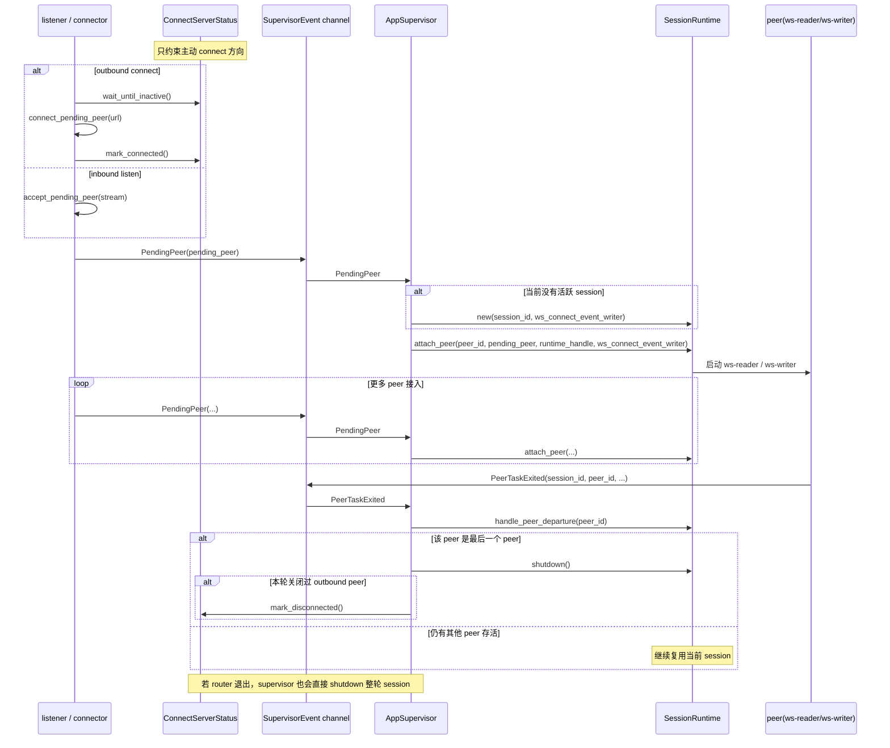

# client-rust

## 项目简介

`client-rust` 是一个运行在设备侧的 WebSocket 音频客户端。

当前版本支持 3 种运行模式：

- `connect-only`：主动连接一个远端 `websocket_server_url`
- `listen-only`：监听 `0.0.0.0:4399`，等待远端连入
- `hybrid`：既监听 `4399`，又在后台持续重试主动连接 `websocket_server_url`

和旧版不同，当前的 `session` 不再等同于“单个 ws 连接”，而是等同于“一组共享本地设备、router、monitor 的对端集合”：

- 第一个 peer 接入时创建 session
- 本地 `Event` 会广播给当前所有 peer
- 某个 peer 发来的 `Request` 只会回给该 peer 自己
- 录音流只会发给发起 `start_recording` 的 peer 集合
- 最后一个 peer 退出时，session 会完整清理并回到监听 / 外连重试空闲态

## 编译与运行

### 本地构建

```bash
cargo build
```

### 运行方式

仅主动连接：

```bash
cargo run -- ws://127.0.0.1:9000
```

仅监听：

```bash
cargo run -- -l
```

监听 + 主动连接：

```bash
cargo run -- -l ws://127.0.0.1:9000
```

开启调试日志时，`debug` 或 `-d` 可以和 `-l` / URL 任意组合：

```bash
cargo run -- -d -l ws://127.0.0.1:9000
```

命令行规则：

- 语法：`client [debug|-d] [-l] [websocket_server_url]`
- `-l` 开启监听模式，监听地址固定为 `0.0.0.0:4399`
- `websocket_server_url` 在 connect-only 和 hybrid 模式下使用
- 不允许既不传 `-l`，也不传 `websocket_server_url`

### 交叉编译 ARMv7

```bash
cross build --release --target armv7-unknown-linux-gnueabihf
```

构建产物：

```bash
./target/armv7-unknown-linux-gnueabihf/release/client
```

## 外部依赖

项目默认依赖以下设备侧命令或文件：

- `aplay`：播放 PCM 音频
- `arecord`：采集 PCM 音频
- `/bin/sh`：执行 `run_shell`
- `mphelper mute_stat`：读取播放状态
- `/tmp/mico_aivs_lab/instruction.log`：instruction monitor 监听文件
- `/tmp/open-xiaoai/kws.log`：kws monitor 监听文件

## 目录结构

```text
src/
├── main.rs
├── app/
│   ├── commands.rs        # session 级命令注册与本地能力装配
│   ├── config.rs          # CLI 解析与 RunConfig
│   ├── fanout.rs          # session 级共享设备、monitor 与录音 fanout 线程
│   ├── session_peer.rs    # SessionRuntime、peer attach/detach、peer/router 退出事件
│   ├── supervisor.rs      # 进程级编排与 SupervisorEvent 总线
│   ├── ws_peer_hub.rs     # peer 表、广播/定向发送、录音订阅
│   ├── ws_ingress.rs      # listener / connector 线程与外连状态闸门
│   └── mod.rs
├── protocol/
│   ├── data.rs            # Event / Request / Response / Stream
│   ├── registry.rs        # 本地命令注册表
│   ├── router.rs          # 会话内统一分发线程
│   └── mod.rs
├── transport/
│   ├── codec.rs           # 协议对象 <-> websocket frame
│   ├── control.rs         # PeerId / PeerSource / SessionControl 等边界类型
│   ├── ws_pump.rs         # 单 peer ws reader/writer 与建连/accept
│   └── mod.rs
├── monitor/
│   ├── file.rs            # 可停止的文件监听基础设施
│   ├── instruction.rs
│   ├── kws.rs
│   ├── playing.rs
│   └── mod.rs
├── audio/
│   ├── config.rs
│   ├── player.rs
│   ├── recorder.rs
│   └── mod.rs
├── shell/
│   ├── command.rs
│   └── mod.rs
└── base/
    ├── debug.rs
    ├── error.rs
    ├── version.rs
    └── mod.rs
```

## 核心架构

### 1. 长生命周期入口

`AppSupervisor` 在进程生命周期内常驻，负责：

- 启动 listener 线程，持续监听 `0.0.0.0:4399`
- 在有 `websocket_server_url` 时启动 connector 线程，持续后台 retry
- 消费 `supervisor.rs` 里的 `SupervisorEvent`，决定何时创建、复用或销毁 `SessionRuntime`

当前 `app` 目录的职责分层如下：

- `supervisor.rs`：承载进程级状态机、`SupervisorEvent` 总线，以及“何时创建/销毁 session”的决策逻辑
- `session_peer.rs`：承载 `SessionRuntime`、peer attach/detach、peer/router 退出等待逻辑
- `ws_peer_hub.rs`：承载 session 内所有网络出口抽象，包括广播、单播、录音订阅集合
- `fanout.rs`：承载 `MediaDevices`、`MonitorHandles` 与录音 fanout 线程
- `commands.rs`：承载命令注册，把本地播放器、录音器、shell 等能力装配到 registry
- `ws_ingress.rs`：承载 listener / connector 线程，以及 `ConnectServerStatus`

### 2. 短生命周期 session

一个 session 内共享以下资源：

- `router-thread`
- `AudioPlayer`
- `AudioRecorder`
- `WsPeerHub`
- `instruction / playing / kws` 三个 monitor
- `record-fanout-thread`

第一个 peer 接入时创建这些资源；最后一个 peer 离开时统一回收。

### 3. 每个 peer 的独立网络收发

每个 peer 都有自己的一套：

- `ws-reader`
- `ws-writer`
- control 队列
- audio 队列
- `WriteSignal`
- 可强制关闭的 `WsPeerHandle`

规则：

- 某个 peer 的 reader 或 writer 任意一个退出，该 peer 立即退出
- 只关闭该 peer，不直接影响其他 peer
- 如果 router 退出，则整轮 session 结束，所有 peer 一起关闭

### 4. `SessionRuntime`、`peer`、`SupervisorEvent`、`ConnectServerStatus`、`WsPeerHub` 的关系

可以把这 5 个对象理解成“资源层”“连接层”“事件层”“外连闸门层”“网络出口层”：

- `SessionRuntime`：表示一轮活跃 session，内部持有 `router`、`AudioPlayer`、`AudioRecorder`、`WsPeerHub`、monitor、fanout 线程等共享资源
- `peer`：表示一个已经挂入当前 session 的 websocket 对端；一个 session 可以同时有多个 peer，但一个 peer 只属于当前这一轮 session
- `SupervisorEvent`：supervisor 的统一事件总线；listener、connector、peer waiter、router waiter 都通过它把变化回报给 `AppSupervisor`
- `ConnectServerStatus`：只服务于主动外连那一路，用来保证同一时刻最多只有一个“已连接的 outbound peer”
- `WsPeerHub`：session 内统一的网络出口抽象；router、命令处理器、录音 fanout 都通过它做 peer 级分发

关系图如下：

```text
listener / connector
  -> 建立 websocket
  -> 发送 SupervisorEvent::PendingPeer
  -> AppSupervisor
       -> 如当前没有 session，则创建 SessionRuntime
       -> 分配 peer_id
       -> 把 peer attach 到 SessionRuntime

SessionRuntime
  -> 管理当前 session 内的全部 peer
  -> 为每个 peer 启动独立的 ws-reader / ws-writer
  -> 共享 router / recorder / player / monitor / WsPeerHub

peer 或 router 退出
  -> waiter 发送 SupervisorEvent::PeerTaskExited / RouterExited
  -> AppSupervisor
       -> 决定只移除单个 peer，还是销毁整轮 SessionRuntime

ConnectServerStatus
  -> outbound peer 存活时：阻塞 connector 继续重连
  -> outbound peer 断开时：放开 connector，允许下一轮 connect retry
```

几个关键约束：

- `AppSupervisor` 在任一时刻最多只持有 0 个或 1 个 `SessionRuntime`
- 第一个 peer 到来时由 `AppSupervisor` 创建 `SessionRuntime`
- 后续 peer 继续加入同一个 `SessionRuntime`
- 最后一个 peer 退出，或者 router 退出时，由 `AppSupervisor` 销毁整个 `SessionRuntime`
- `ConnectServerStatus` 不管理 listen 进来的 peer，也不管理 session 内 peer 总数；它只限制主动 connect 方向不要并发建出多个 outbound peer

### 5. 典型时序图

下面这张图描述的是“首个 peer 接入创建 session，后续 peer 加入，最后 peer 退出后回收 session”的典型过程。



## 消息模型

### 入站

`ws-reader` 会把消息解码成：

- `InboundMessage::Request`
- `InboundMessage::Response`
- `InboundMessage::Event`
- `InboundMessage::Stream`

并附带 `peer_id` 一起送进 `route_channel`。

### 出站

router 和 monitor 不直接持有 websocket，它们只产生：

- `RoutedOutbound { target: Broadcast, ... }`
- `RoutedOutbound { target: ToPeer(peer_id), ... }`

再由 `WsPeerHub` 按目标分发：

- `Broadcast`：广播给所有 peer
- `ToPeer(peer_id)`：只发给指定 peer

### 当前行为约定

- 本地 `instruction` / `playing` / `kws` 事件：广播
- `Request` 的 `Response`：回给原始 peer
- 入站 `Stream(tag="play")`：只做本地播放，不回网
- 录音 `Stream(tag="record")`：只发给录音订阅者

## 录音语义

录音不是“每个 peer 一个 recorder”，而是“session 里一个全局 recorder + 多个订阅者”。

`start_recording` 行为：

- 第一个订阅者启动真正的 `AudioRecorder`
- 第一条生效请求锁定本轮 `AudioConfig`
- 后续 peer 如果配置相同，加入订阅集合
- 后续 peer 如果配置不同，返回错误
- 同一 peer 重复 `start_recording` 按幂等处理

`stop_recording` 行为：

- 只移除当前 peer 的订阅
- 当最后一个订阅者离开时，真正停止 recorder
- peer 断线时也会自动移除它的录音订阅

## monitor 生命周期

当前版本里 monitor 生命周期由 supervisor 显式托管，而不是由 router 隐式拉起：

- session 创建时启动 monitor
- session 结束时先发 stop token
- 文件监听会定期检查 stop token，从阻塞等待里退出
- 这样 listen-only 模式在“最后一个 peer 退出”后不会残留 monitor 线程

## 支持的远端命令

### `get_version`

- 返回当前客户端版本号

### `run_shell`

- 通过 `/bin/sh -c` 执行服务端下发脚本
- 返回 `stdout`、`stderr`、`exit_code`

### `start_play`

- 启动全局播放器
- 可携带自定义 `AudioConfig`

### `stop_play`

- 停止全局播放器

### `start_recording`

- 为当前 peer 建立录音订阅
- 可携带自定义 `AudioConfig`
- 首个活动订阅者决定本轮录音配置

### `stop_recording`

- 取消当前 peer 的录音订阅
- 最后一个订阅者离开时才真正停录音

## 生命周期总结

### listen-only

```text
空闲监听
  -> 第一个 peer 接入
  -> 创建 session
  -> peer 增减
  -> 最后一个 peer 退出
  -> 清理 session
  -> 回到空闲监听
```

### connect-only

```text
后台 retry connect
  -> 外连成功
  -> 创建 session
  -> 该 peer 退出
  -> 清理 session
  -> 重新进入后台 retry
```

### hybrid

```text
监听 4399 + 后台 retry connect 同时运行
  -> 谁先接入谁先创建 session
  -> 其他 peer 后续继续加入同一 session
  -> 所有 peer 退出后清理 session
  -> 监听和 connect retry 继续常驻
```

## 验证

开发时可以用以下命令做基础验证：

```bash
cargo check
cargo test
```

当前测试重点覆盖：

- CLI 解析
- `WsPeerHub` 的广播 / 定向发送
- 录音订阅与配置冲突语义
- 现有协议编解码与事件格式兼容性

## 阅读建议

如果你是第一次阅读这个项目，比较推荐按下面顺序看：

1. `main.rs`：先理解程序入口如何解析配置并启动 `AppSupervisor`
2. `app/supervisor.rs`：理解进程级主循环、`SupervisorEvent` 总线，以及 session 何时创建/销毁
3. `app/session_peer.rs`：理解单轮 session 内部有哪些共享资源，以及 peer attach/detach 的过程
4. `app/ws_peer_hub.rs`：理解广播、单播、录音订阅和 peer 表是如何统一管理的
5. `protocol/router.rs`：理解入站请求、本地命令执行、回包和出站分发
6. `app/ws_ingress.rs`：理解 listener / connector 如何把“已握手成功的 peer”送回 supervisor

当前源码里的中文注释遵循两个原则：

- 函数定义上方优先解释“这个函数在生命周期里承担什么职责”
- 关键子函数调用前优先解释“每个入参为什么这么传、调用后希望得到什么结果”
